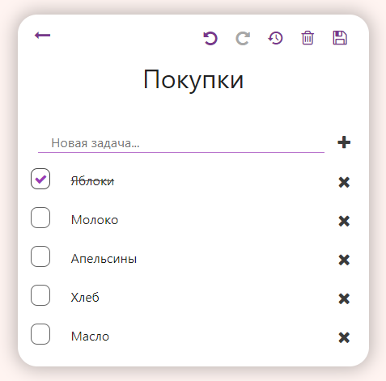

# Note List

This is my first test project on Vue.js

## [DEMO](https://note-list.netlify.app/)

## Project Description

This app has two pages.

All actions occur without reloading the page.
Confirm actions is satisfied with a dialog modal window.
After reloading the page, the state of the list of notes is saved using local storage.

A list of all notes is displayed on the main page.

For each note, a title and todo list are displayed, reduced to several points, without the ability to mark.

Actions on the main page:
- go on to create a new note
- go to edit a note
- delete (confirmation required)

Actions with a note:
- save changes
- cancel changes (confirmation required)
- delete (confirmation required)
- undo change
- redo change

Actions with a todo items:
- add
- remove
- edit text
- mark as done